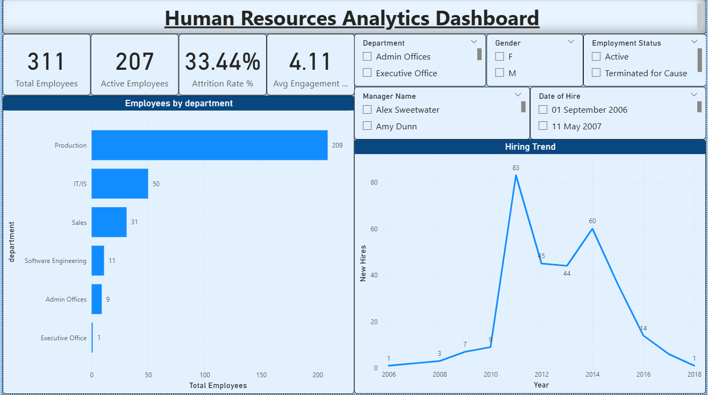
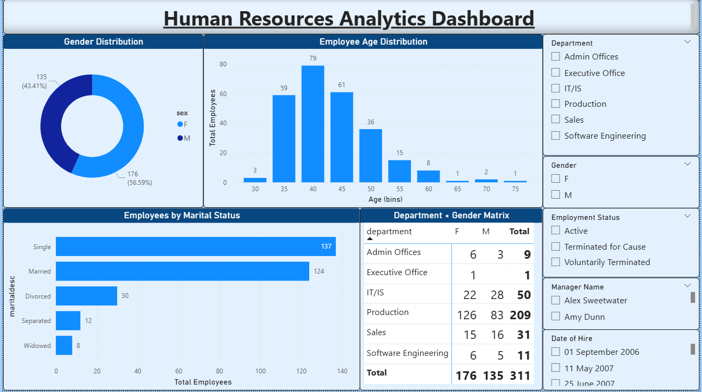
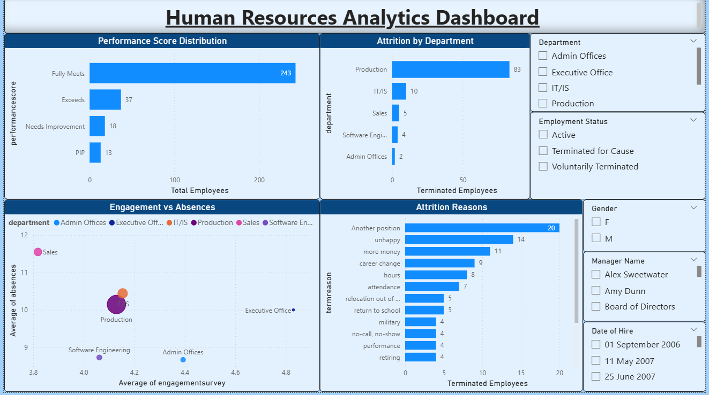

# Human Resources Analytics Dashboard

## Project Overview

This project is an interactive Human Resources Analytics Dashboard developed using Power BI to analyze workforce data and generate meaningful business insights.

The dashboard helps HR teams monitor:
- Employee demographics
- Attrition trends
- Hiring patterns
- Employee performance
- Workforce engagement
- Department-wise employee distribution

---

# Tools & Technologies Used

- Power BI
- DAX
- Power Query
- Data Visualization
- Data Analytics

---

# Dashboard Features

## HR Overview
- Total Employees
- Active Employees
- Attrition Rate
- Average Engagement Score

## Workforce Demographics
- Gender Distribution
- Age Distribution
- Marital Status Analysis
- Department-wise Employee Distribution

## Attrition & Performance Analysis
- Attrition by Department
- Attrition Reasons
- Performance Score Distribution
- Engagement vs Absences Analysis
- Hiring Trend Analysis

---

# Dashboard Screenshots

## Overview Dashboard

---

## Employee Demographics Dashboard

---

## Attrition & Performance Dashboard

---

# Key Business Insights

- Production department has the highest employee count and highest attrition.
- Majority of employees fall within the 35–45 age group.
- Most employees are rated as “Fully Meets” in performance evaluation.
- Employee engagement has a noticeable relationship with absenteeism.
- The major attrition reason is employees moving to another position.

---

# Project Workflow

1. Data Collection
2. Data Cleaning & Transformation
3. Data Modeling
4. DAX Calculations
5. Dashboard Development
6. Business Insight Generation

---

# Files Included

- `.pbix` dashboard file
- Dashboard screenshots
- Project documentation

---

# How to Use

1. Download the `.pbix` file
2. Open using Power BI Desktop
3. Explore dashboard pages and filters

---

# Author

Aryan Sharan
